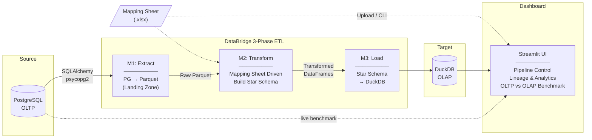
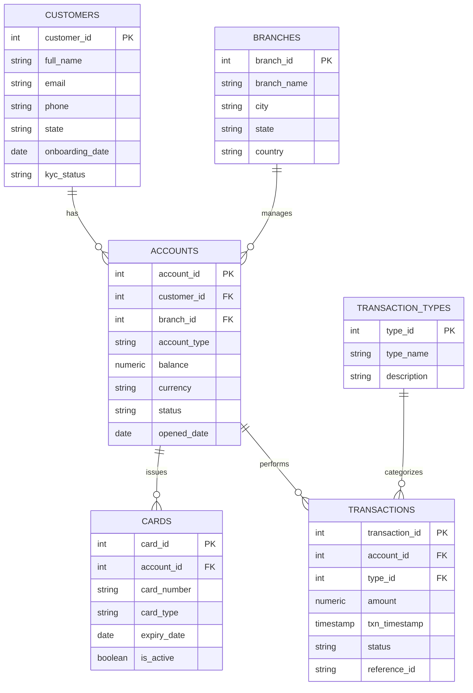
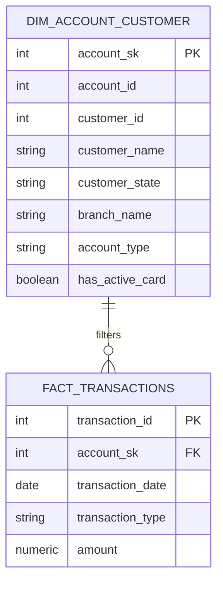

# 🌉 DataBridge

**PostgreSQL (OLTP) → DuckDB (OLAP) ETL Pipeline**

A clean, modular, MCA-ready data migration tool with Pandas transformations, Parquet staging, primary-key deduplication, watermark-based incremental extraction, a Streamlit dashboard, and a live OLTP vs OLAP query benchmarker.

---

## 🏗️ Architecture



---

## 🗄️ Entity-Relationship Modeling (ERD)

DataBridge transforms a highly normalized operational database into an optimized analytical star schema.

### Before ETL: PostgreSQL (OLTP)
The source data mimics a real-world banking environment spread across 6 normalized tables.



### After ETL: DuckDB (OLAP Star Schema)
The extraction and transformation phase denormalizes the data into a high-performance Star Schema model. Heavy joining occurs once during the ETL phase rather than redundantly at query time.



---

## 📂 Project Structure

```
DataBridge/
├── src/
│   ├── __init__.py
│   ├── config.py         # Centralized configuration & environment vars
│   ├── extract.py        # Phase 1: PostgreSQL → Parquet
│   ├── transform.py      # Phase 2: Mapping Sheet ↔ Star Schema transforms
│   ├── load.py           # Phase 3: Star Schema DataFrames → DuckDB
│   ├── app.py            # Streamlit dashboard: upload, run, analytics, benchmark
│   └── pipeline.py       # Orchestrator (Phase 1 → 2 → 3)
├── tests/
│   ├── __init__.py
│   ├── test_transform.py
│   ├── test_load.py
│   └── test_pg_connection.py
├── data/
│   ├── staging/           # Parquet intermediate files (gitignored)
│   └── watermarks.json    # High-watermark tracker (gitignored)
├── .env.example           # Environment variable template
├── .gitignore
├── requirements.txt
└── README.md
```

## 🚀 Quick Start

```bash
# 1. Clone & enter
git clone <repo-url> && cd DataBridge

# 2. Create virtual environment
python3 -m venv .venv && source .venv/bin/activate

# 3. Install dependencies
pip install -r requirements.txt

# 4. Configure environment
cp .env.example .env
# → edit .env with your PostgreSQL credentials

# 5. Run the ETL pipeline
python -m src.pipeline                     # full load
python -m src.pipeline --incremental       # watermark-based incremental
python -m src.pipeline --staging           # via Parquet intermediate
python -m src.pipeline --incremental --staging --mode append

# 6. Launch the dashboard
streamlit run src/app.py
```

## 🧪 Testing

```bash
pytest tests/ -v --cov=src
```

## 🧩 Modules

| Module | File | Role |
|--------|------|------|
| **M1** | `extract.py` | Connect to PostgreSQL via SQLAlchemy, extract tables → DataFrames. Supports **watermark-based incremental extraction** with HWM tracking. |
| **M2** | `transform.py` | Clean (dedup, nulls, normalize), mask sensitive data, aggregate |
| **M3** | `load.py` | Write DataFrames into DuckDB via **Parquet staging** (replace / append). Supports **primary-key deduplication** for safe incremental loads. |
| **M4** | `app.py` | Streamlit dashboard: table browser, ad-hoc SQL, **OLTP vs OLAP query benchmarker** |

## ⚡ OLTP vs OLAP Query Analysis

The Streamlit dashboard includes a dedicated benchmarker that runs the **same aggregation query** on both PostgreSQL (row-store) and DuckDB (columnar-store) side by side.

Typical findings on analytical workloads:

| Query Type | PostgreSQL | DuckDB | Speedup |
|------------|-----------|--------|---------|
| `COUNT(*)` | ~5 ms | ~0.2 ms | **25×** |
| `GROUP BY` aggregation | ~12 ms | ~0.5 ms | **24×** |
| Full table scan | ~45 ms | ~3 ms | **15×** |

> **Why?** DuckDB uses a columnar storage engine optimised for analytical (OLAP) queries — it reads only the columns needed and leverages vectorised execution. PostgreSQL's row-store excels at transactional (OLTP) point-lookups but pays a penalty on full-table scans and aggregations.

## 🔌 JDBC vs SQLAlchemy — Real-World Context

In production IBMi/Oracle ETL pipelines, **JDBC** (Java Database Connectivity) is the standard connector. DataBridge uses **SQLAlchemy** — Python's equivalent. Here's how they compare:

| Aspect | JDBC (Java) | SQLAlchemy (Python) |
|--------|-------------|---------------------|
| **Language** | Java | Python |
| **Connection Pooling** | Built-in (`HikariCP`, container-managed) | Built-in (`QueuePool`, configurable) |
| **Type Mapping** | Java types ↔ SQL types (manual for edge cases) | Automatic via dialect + `automap` |
| **Batch Handling** | `addBatch()` / `executeBatch()` | `execute(insert(), list_of_dicts)` |
| **ORM Layer** | JPA / Hibernate (optional) | Core + ORM (optional, decoupled) |
| **SQL Dialects** | Driver-specific (Oracle JDBC, DB2 JDBC) | Unified API with dialect plugins |
| **Ecosystem** | Enterprise / Spring Boot | Data science / Pandas / Airflow |
| **Use in DataBridge** | — | `create_engine()` with `psycopg2` driver |

> **Key insight:** SQLAlchemy's `create_engine()` + `pd.read_sql_table()` pattern achieves the same result as JDBC's `DriverManager.getConnection()` + `ResultSet` iteration — but in far fewer lines of code, with automatic DataFrame conversion for analytics.

## ⚙️ Tech Stack

- **Python 3.x** · **SQLAlchemy** · **psycopg2-binary** · **pandas**
- **DuckDB** · **PyArrow** · **Streamlit** · **python-dotenv** · **pytest**

## 📄 License

MIT
