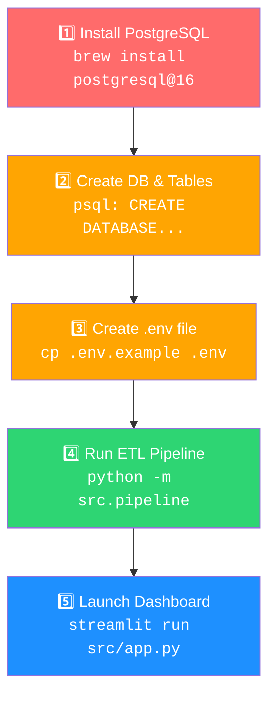

# 🌉 DataBridge — What You Need To Do To Run This Application

## Current Status (✅ What's Already Working)

| Item | Status |
|------|--------|
| Python 3.11 virtual environment (`.venv`) | ✅ Active |
| All pip dependencies installed | ✅ Installed |
| Source code (`extract.py`, `transform.py`, `load.py`, `pipeline.py`, `app.py`) | ✅ Complete |
| Unit tests (11 tests) | ✅ All passing |
| GitHub Actions CI workflow | ✅ Configured |

---

## ❌ What's Blocking You Right Now

You tried to run:
1. `streamlit run app.py` → **Failed** — file is at `src/app.py`, not `app.py`
2. `python src/app.py` → **Failed** — DuckDB file `data/databridge.duckdb` doesn't exist yet
3. The DuckDB doesn't exist because the ETL pipeline hasn't run
4. The ETL pipeline can't run because there's no PostgreSQL database set up

**The root cause:** You need a PostgreSQL database with data **first**, then run the ETL to create the DuckDB, **then** launch the dashboard.

---

## 📋 Complete Checklist — What You Need To Do

### Step 1: Install & Start PostgreSQL

> [!IMPORTANT]
> PostgreSQL is **not installed** on your Mac. This is the source database that the ETL pipeline extracts data from.

```bash
# Install PostgreSQL via Homebrew
brew install postgresql@16

# Start the PostgreSQL service
brew services start postgresql@16

# Verify it's running
pg_isready
```

After installation, create a database and user:

```bash
# Connect to the default postgres database
psql postgres

# Inside psql, run:
CREATE DATABASE your_database;
CREATE USER your_user WITH PASSWORD 'your_password';
GRANT ALL PRIVILEGES ON DATABASE your_database TO your_user;
\q
```

---

### Step 2: Populate PostgreSQL With Sample Data

> [!IMPORTANT]
> The ETL pipeline extracts from `public` schema tables. You need at least one table with data in PostgreSQL.

```bash
psql -U your_user -d your_database
```

Example — create a sample `customers` and `orders` table:

```sql
CREATE TABLE customers (
    id SERIAL PRIMARY KEY,
    name VARCHAR(100),
    email VARCHAR(100),
    phone VARCHAR(20),
    created_at TIMESTAMP DEFAULT NOW(),
    updated_at TIMESTAMP DEFAULT NOW()
);

INSERT INTO customers (name, email, phone) VALUES
('Alice Johnson', 'alice@example.com', '555-0101'),
('Bob Smith', 'bob@example.com', '555-0202'),
('Carol White', 'carol@example.com', '555-0303');

CREATE TABLE orders (
    id SERIAL PRIMARY KEY,
    customer_id INT REFERENCES customers(id),
    amount DECIMAL(10,2),
    status VARCHAR(20),
    created_at TIMESTAMP DEFAULT NOW(),
    updated_at TIMESTAMP DEFAULT NOW()
);

INSERT INTO orders (customer_id, amount, status) VALUES
(1, 250.00, 'completed'),
(2, 150.50, 'pending'),
(1, 75.00, 'completed'),
(3, 300.00, 'shipped');
```

---

### Step 3: Create the `.env` File

> [!CAUTION]
> The `.env` file does **NOT exist** — only `.env.example` is present. Without this file, **every module** (extract, load, app) will fail to connect.

```bash
cp .env.example .env
```

Then edit `.env` with your actual PostgreSQL credentials:

```ini
# ── PostgreSQL (source OLTP) ──────────────────────────
PG_HOST=localhost
PG_PORT=5432
PG_DATABASE=your_database      # ← change to your DB name
PG_USER=your_user              # ← change to your username
PG_PASSWORD=your_password      # ← change to your password

# ── DuckDB (target OLAP) ─────────────────────────────
DUCKDB_PATH=data/databridge.duckdb

# ── Staging / Incremental ────────────────────────────
STAGING_DIR=data/staging
WATERMARK_PATH=data/watermarks.json
```

---

### Step 4: Run the ETL Pipeline (Creates the DuckDB)

> [!IMPORTANT]
> This is the step that creates `data/databridge.duckdb`. **The dashboard cannot work without this.**

```bash
# Activate venv (if not already)
source .venv/bin/activate

# Run the full ETL pipeline
python -m src.pipeline
```

Optional variations:

```bash
# With Parquet staging (mirrors production STG pattern)
python -m src.pipeline --staging

# Incremental mode (requires WATERMARK_MAP config in pipeline.py)
python -m src.pipeline --incremental

# Append instead of replace
python -m src.pipeline --mode append
```

---

### Step 5: Launch the Streamlit Dashboard

```bash
# ✅ Correct command (from project root)
streamlit run src/app.py
```

> [!WARNING]
> Do **NOT** run `streamlit run app.py` (no `src/` prefix) — the file is inside the `src/` directory.
> Do **NOT** run `python src/app.py` — Streamlit apps must be launched via `streamlit run`.

---

### Step 6 (Optional): Configure Incremental Extraction

If you want watermark-based incremental loads, edit [pipeline.py](file:///Users/AJAYFELIX/Uitlity/DataBridge/src/pipeline.py#L25-L28) and uncomment/configure the `WATERMARK_MAP`:

```python
WATERMARK_MAP: dict[str, str] = {
    "orders":    "updated_at",
    "customers": "updated_at",
}
```

Then run: `python -m src.pipeline --incremental`

---

## 📊 Execution Order Summary



---

## 🗂️ Files You Need To Create / Change

| File | Action | Purpose |
|------|--------|---------|
| `.env` | **CREATE** (from `.env.example`) | Database credentials — required by every module |
| PostgreSQL database | **CREATE** externally | Source OLTP data for extraction |
| `data/staging/` | Auto-created | Created automatically when using `--staging` flag |
| `data/databridge.duckdb` | Auto-created | Created automatically by the ETL pipeline |
| `data/watermarks.json` | Auto-created | Created automatically in incremental mode |
| `src/pipeline.py` L25-28 | **OPTIONAL EDIT** | Uncomment `WATERMARK_MAP` for incremental extraction |

---

## 🧪 Verification

After completing all steps, verify everything works:

```bash
# Tests should still pass (they use in-memory DuckDB, no PG needed)
pytest tests/ -v

# The dashboard should open at http://localhost:8501
streamlit run src/app.py
```

On the dashboard you should see:
- **📋 Tables** sidebar — lists tables extracted from PostgreSQL
- **🔍 Preview** tab — view table data
- **📝 Ad-Hoc Query** tab — run SQL against DuckDB
- **⚡ OLTP vs OLAP** tab — benchmark PostgreSQL vs DuckDB (requires PG connection)
