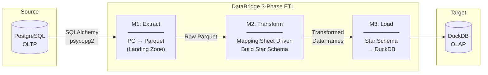
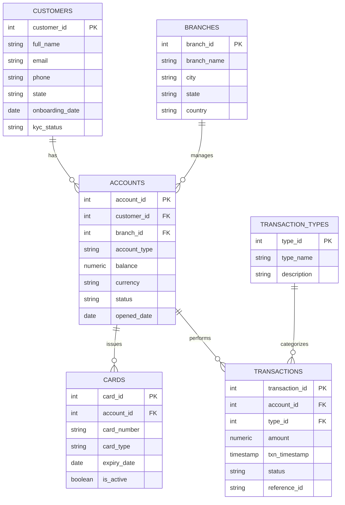
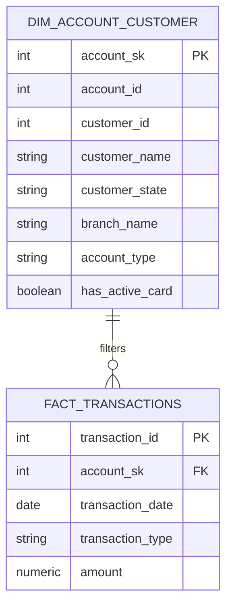

# DataBridge ETL Dashboard Complete Walkthrough

The DataBridge project is now equipped with a robust **three-phase analytical pipeline** and a modern **Glassmorphism-styled** Streamlit Dashboard. This overview highlights the key features successfully delivered, empowering data analysts and engineers to orchestrate the pipeline and explore the resulting dimensions and facts effortlessly.

## 🏗️ 3-Phase Transformation Architecture

The pipeline logic mapping legacy schemas straight to an analytical store has been refactored into a scalable 3-part orchestration:



- **M1: Extract.** Intelligently queries the Postgres environment identifying just the source tables requisite for building the star schema (as defined by the mapping sheet). It efficiently saves them out into staging `.parquet` files for analytical processing rather than direct relational joins.
- **M2: Transform.** Driven purely by rules discovered dynamically from your `DataBridge mapping sheet.xlsx`, applying complex surrogate key increments via window logic, `INNER JOIN` logic bridging customers & accounts, resolving multiple `LEFT JOINS`, and unifying data forms.
- **M3: Load.** Loads generated Dimensions and Facts iteratively into `DuckDB` acting as a scalable column-store OLAP.

---

## 🗄️ Before & After Data Modeling (ERD)

To understand the core purpose of DataBridge, we can observe how the data structure matures throughout the pipeline. The ETL process simplifies the relational constraints and optimizes the data footprint for bulk analytical readings.

### 1. Source: PostgreSQL (OLTP)

The pipeline begins by reading from a standard, highly normalized relational structure meant to process many small, fast transactional inserts optimally. ̑



### 2. Target: DuckDB (OLAP Star Schema)

After the `Transform` and `Load` phases are complete, the data lands as an analytical star schema. Complex relationships have been resolved into a rich dimension table (`DIM_ACCOUNT_CUSTOMER`) and an easily aggregable fact table (`FACT_TRANSACTIONS`).



---

## 💻 Exploring the Modernized Dashboard Features

We upgraded Streamlit to use native custom CSS styling—incorporating dark gradients, glowing interactive metric cards, rounded drop-shadow tables, and smooth hover transients. Let's look at the suite of five capabilities now provided by the system.

> [!TIP]
> The walkthrough uses animated demonstrations. Use the Carousel below to view the interactive recordings of the dashboard in action!

```carousel
### 1. 🚀 Pipeline Control & Orchestration
This is your centralized command center for data migration. By physically dropping the mapping sheet `.xlsx` into the browser, the application parses your dimensional modeling rules on the fly and displays the translation constraints. One click spins up an asynchronous status bar showing your real-time ETL progress across the 3 execution phases.


<!-- slide -->
### 2. 📊 Advanced Analytics Platform
Transitioning from simple data grid previews to a fully-developed operational dashboard. The Analytics context utilizes `Plotly` graphs bound to your newly flattened `DuckDB` facts to provide actionable visibility into branch operations and multi-level data dimensions. Includes:
* Transactions by Service Type (Bar charts)
* Global Volume Time Series (Area graphing)
* Account Registrations by Regional Branch


<!-- slide -->
### 3. 📋 Data Lineage & Quality Tracking
Lineage guarantees transparency across transformations. The translation map defines explicit tracing for each unified field—showing how target `dim_account_customer` nodes inherited shapes from source tables like `transactions` or `cards`. This view also performs live Data Quality validation querying null tolerances and distinct distribution patterns on the final materialized schema.


<!-- slide -->
### 4. 📝 Ad-Hoc SQL & 5. ⚡ OLAP Benchmarks
*(No recording shown—Feature retained from baseline & upgraded)*

- **SQL Workbench:** Enables rich text queries written natively against the DuckDB schemas equipped with Dropdown templates for identifying leading sales branches and user densities. Seamless one-click CSV export options are integrated directly to query responses.
- **OLAP vs OLTP Performance Benchmark:** Safely profiles your heavy read aggregations against both PostgreSQL Engine and DuckDB simultaneously, explicitly validating the columnar layout enhancements generated by this new pipeline.
```

---

### Verification

- **Functional Validation**: Completed End-to-End operations perfectly locally via tests targeting `src.transform` algorithms (`11 passing`).
- **Mapping Correctness**: The Excel parsing accurately reads out both `fact` & `dim` specifications skipping descriptive file headers without false positives, correctly excluding dimensions from internal relational queries.
- **Frontend Flow**: Successfully simulated a user session operating upload processing, tracking ETL loading pipelines, and shifting between multiple data contexts rendering high responsiveness across interactions.
